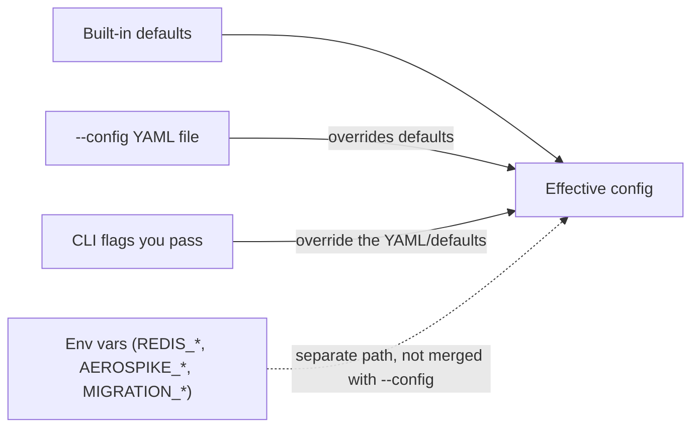

# 05 - Running and tuning a migration

This guide covers the three ways to configure the tool and how they combine, the
performance knobs, and how to read everything the tool prints during a run.

## How configuration is resolved

There are three independent sources of configuration. Understanding how they
interact prevents surprises.



The rules:

1. **CLI flags + `--config` YAML work together.** The YAML file is the **base**
   configuration; any flag you *also* pass on the command line **overrides** the
   matching value. Keys you omit from the YAML fall back to the built-in
   defaults, so a partial file is valid.
2. **A flag you don't pass keeps the YAML/default value.** The tool only applies
   flags you explicitly set.
3. **Environment variables are a separate path.** They populate the defaults but
   are **not merged with `--config`**. In practice: use env vars *or* a YAML
   file as your base, then layer CLI flags on top.

```bash
# Load everything from the file, but override the namespace just for this run:
redis-to-aerospike --config config.example.yaml --aerospike-namespace staging
```

A fully annotated example file ships with the project:
[`config.example.yaml`](../config.example.yaml).

### On/off flags can only turn things on

Boolean switches like `--aerospike-tls-enable`, `--aerospike-send-key`,
`--aerospike-use-services-alternate`, and `--dry-run` can only turn an option
**on** from the command line. To turn one off when a YAML file enables it, set it
to `false` in the YAML.

## Previewing with `--dry-run`

`--dry-run` connects to both Redis and Aerospike, gathers server info, prints the
preview block, and exits **without writing anything**. Use it as a fast
reachability and configuration check before a real run.

```bash
redis-to-aerospike --config prod.yaml --dry-run
```

## Performance knobs

| Knob | CLI flag | YAML key | Env var | Default | What it does |
| --- | --- | --- | --- | --- | --- |
| Worker threads | `--workers` | `workers` | `MIGRATION_WORKERS` | `8` | Parallel writers to Aerospike. Raise this first if Aerospike is the bottleneck and has headroom. |
| Scan batch size | `--scan-batch` | `scan_batch` | `MIGRATION_SCAN_BATCH` | `500` | Keys fetched per Redis `SCAN` round-trip. Larger = fewer round-trips. |
| Queue size | `--queue-size` | `queue_size` | `MIGRATION_QUEUE_SIZE` | `10000` | Bounded buffer between the reader and the writers; provides back-pressure. |
| Scan rate limit | `--scan-rate-limit` | `scan_rate_limit` | `MIGRATION_SCAN_RATE_LIMIT` | `0` (unlimited) | Caps records/sec pulled from Redis, throttling `SCAN` so a busy source isn't overwhelmed. |
| Write rate limit | `--write-rate-limit` | `write_rate_limit` | `MIGRATION_WRITE_RATE_LIMIT` | `0` (unlimited) | Caps the aggregate records/sec written to Aerospike across all workers. |
| Write batch size | `--write-batch-size` | `write_batch_size` | `MIGRATION_WRITE_BATCH_SIZE` | `1` (single writes) | Records per Aerospike `batch_write`. `> 1` reduces round-trips; `1` writes one record at a time. |

Guidance:

- Start with the defaults. They are reasonable for most workloads.
- If throughput is low and your Aerospike cluster is underutilized, increase
  `--workers`.
- The bounded queue means a fast Redis read won't run the process out of memory
  waiting on Aerospike. There's rarely a need to change `--queue-size` unless
  you're deliberately trading memory for smoothing.
- If the migration competes with live traffic, cap it with `--scan-rate-limit`
  and/or `--write-rate-limit` (records/sec) so it can't overwhelm either side.
  Both default to `0` (unlimited) and each allows a short burst of up to one
  second's worth of the configured rate. `--write-rate-limit` is the aggregate
  ceiling across all workers, so it bounds total load regardless of `--workers`.
- For large migrations, set `--write-batch-size` above `1` to insert records with
  Aerospike `batch_write`, cutting per-record round-trips. Each record keeps its
  own TTL and is checked against its own batch reply, so a single bad record only
  fails itself. Because the rate limit counts individual records, not batches,
  `--write-rate-limit` still bounds true load when batching is enabled.
- Batching is **per-worker**: each of the `--workers` threads fills and flushes
  its own buffer, so up to `workers * write_batch_size` records may be buffered in
  memory at once (on top of the queue), and each worker flushes its own trailing
  partial batch when the run ends. Keep `workers * write_batch_size` well below
  `--queue-size` so the bounded queue still provides back-pressure; very large
  products of the two trade memory for fewer round-trips.

## Reading the output

Everything goes through Python's standard logging, so output is consistent and
easy to redirect. Control verbosity with `--log-level` (`DEBUG`, `INFO`,
`WARNING`, `ERROR`; default `INFO`).

A single run prints four things, in order:

### 1. Preview (before any writes)

A `migration preview` block summarizing both sides:

- **Redis**: endpoint, `SCAN` match, key count, keys carrying a TTL, memory
  usage, and server version.
- **Aerospike**: hosts, namespace, set, value bin, auth summary (password
  masked), TLS summary, timeouts, plus the namespace's `nsup-period`,
  `max-record-size`, and `stop-writes-pct`.
- **Pipeline**: workers, scan batch, queue size, scan/write rate limits, write
  batch size, hash strategy, TTL overflow policy, max TTL, max record size,
  progress interval, and an estimated key count.

### 2. Server-info checks

Using what it read from Aerospike, the tool:

- **Warns** when `nsup-period=0` (TTL eviction disabled) *and* Redis does not
  report keys with TTL — since any TTLs written this run would never be enforced.
- **Aborts** (exit code `2`) when `nsup-period=0` **and** Redis reports keys with
  an expiry (`INFO keyspace` `expires` > 0), since those records cannot be
  meaningfully migrated with working TTL expiration.
- **Aligns** its max-record-size guard with the server's advertised limit.

### 3. Progress heartbeat (during the run)

A background thread logs one compact `progress:` line every
`--progress-interval` seconds (YAML `progress_interval`, env
`MIGRATION_PROGRESS_INTERVAL`; default `10`, set `0` to disable). It shows
running counts and throughput and never logs per record, so it neither spams the
console nor measurably affects performance.

```
progress: scanned=12000 migrated=11980 skipped=15 errors=5 throughput=2400/s
```

### 4. Summary (at the end)

A `migration summary` with the high-level counters (scanned, migrated, skipped,
errors), elapsed time, throughput, and -- when non-empty -- the skip and error
breakdowns by reason:

```
migration summary
  scanned    : 12000
  migrated   : 11980
  skipped    : 15
  errors     : 5
  elapsed    : 5.00s
  throughput : 2396 records/s
  skipped by type:
    - stream: 15
  errors by type:
    - write:RecordTooLargeError: 5
```

It is logged at `WARNING` (and the process exits non-zero) when there were
errors, otherwise at `INFO`.

## Exit codes

| Code | Meaning |
| --- | --- |
| `0` | Success -- the migration completed with no errors. |
| `1` | The migration ran but finished with one or more errors (see the summary's "errors by type"). |
| `2` | Could not reach Redis or Aerospike; nothing was migrated. |

These make the tool easy to use in scripts and CI:

```bash
if redis-to-aerospike --config prod.yaml; then
  echo "migration clean"
else
  echo "migration had errors or could not connect (exit $?)" >&2
fi
```

## Redirecting and capturing logs

Because all output uses standard logging (to stderr), you can capture it like any
other command:

```bash
redis-to-aerospike --config prod.yaml --log-level INFO 2> migration.log
```

Next: [Troubleshooting](06-troubleshooting.md).
